| Copyright
|   Markus Wittmann, 2016-2018
|   RRZE, University of Erlangen-Nuremberg, Germany
|   markus.wittmann -at- fau.de or hpc -at- rrze.fau.de
|
|   Viktor Haag, 2016
|   LSS, University of Erlangen-Nuremberg, Germany
|
| This file is part of the Lattice Boltzmann Benchmark Kernels (LbmBenchKernels).
|
| LbmBenchKernels is free software: you can redistribute it and/or modify
| it under the terms of the GNU General Public License as published by
| the Free Software Foundation, either version 3 of the License, or
| (at your option) any later version.
|
| LbmBenchKernels is distributed in the hope that it will be useful,
| but WITHOUT ANY WARRANTY; without even the implied warranty of
| MERCHANTABILITY or FITNESS FOR A PARTICULAR PURPOSE.  See the
| GNU General Public License for more details.
|
| You should have received a copy of the GNU General Public License
| along with LbmBenchKernels.  If not, see <http://www.gnu.org/licenses/>.

.. title:: LBM Benchmark Kernels Documentation 

**LBM Benchmark Kernels Documentation**

.. sectnum::
.. contents::

Introduction
============

The lattice Boltzmann (LBM) benchmark kernels are a collection of LBM kernel
implementations.

**AS SUCH THE LBM BENCHMARK KERNELS ARE NO FULLY EQUIPPED CFD SOLVER AND SOLELY
SERVES THE PURPOSE OF STUDYING POSSIBLE PERFORMANCE OPTIMIZATIONS AND/OR
EXPERIMENTS.**

Currently all kernels utilize a D3Q19 discretization and the
two-relaxation-time (TRT) collision operator [ginzburg-2008]_.
All operations are carried out in double or single precision arithmetic.

Compilation
===========

The benchmark framework currently supports only Linux systems and the GCC and 
Intel compilers. Every other configuration probably requires adjustment inside
the code and the makefiles. Furthermore some code might be platform or at least
POSIX specific.

The benchmark can be build via ``make`` from the ``src`` subdirectory. This will
generate one binary which hosts all implemented benchmark kernels. 

Binaries are located under the ``bin`` subdirectory and will have different names
depending on compiler and build configuration.

Compilation can target debug or release builds. Combined with both build types
verification can be enabled, which increases the runtime and hence is not
suited for benchmarking.

Debug and Verification
----------------------

:: 

  make BUILD=debug BENCHMARK=off

Running ``make`` with ``BUILD=debug`` builds the debug version of
the benchmark kernels, where no optimizations are performed,  line numbers and
debug symbols are included as well as ``DEBUG`` will be defined.  The resulting
binary will be found in the ``bin`` subdirectory and named
``lbmbenchk-linux-<compiler>-debug``.
 
Specifying ``BENCHMARK=off`` turns on verification
(``VERIFICATION=on``), statistics (``STATISTICS=on``), and VTK output
(``VTK_OUTPUT=on``) enabled. 

Please note that the generated binary will therefore
exhibit a poor performance.

Release and Verification
------------------------

Verification with the debug builds can be extremely slow. Hence verification
capabilities can be build with release builds: ::

  make BENCHMARK=off 

Benchmarking
------------

To generate a binary for benchmarking run make with ::

  make 

As default ``BENCHMARK=on`` and ``BUILD=release`` is set, where
``BUILD=release`` turns optimizations on and ``BENCHMARK=on`` disables
verfification, statistics, and VTK output.

See Options Summary below for further description of options which can be
applied, e.g. TARCH as well as the Benchmarking section.

Compilers
---------

Currently only the GCC and Intel compiler under Linux are supported. Between
both configuration can be chosen via ``CONFIG=linux-gcc`` or
``CONFIG=linux-intel``.

Floating Point Precision
------------------------

As default double precision data types are used for storing PDFs and floating
point constants. Furthermore, this is the default for the intrincis kernels. 
With the ``PRECISION=sp`` variable this can be changed to single precision. ::

  make PRECISION=sp   # build for single precision kernels

  make PRECISION=dp   # build for double precision kernels (defalt)

Cleaning
--------

For each configuration and build (debug/release) a subdirectory under the
``src/obj`` directory is created where the dependency and object files are
stored.
With ::

  make CONFIG=... BUILD=... clean

a specific combination is select and cleaned, whereas with ::

  make clean-all

all object and dependency files are deleted.

Options Summary
---------------

Options that can be specified when building the suite with make:

============= ======================= ============ ==========================================================
name          values                  default      description
============= ======================= ============ ==========================================================
BENCHMARK     on, off                 on           If enabled, disables VERIFICATION, STATISTICS, VTK_OUTPUT. If disabled enables the three former options.
BUILD         debug, release          release      debug: no optimization, debug symbols, DEBUG defined. release: optimizations enabled.
CONFIG        linux-gcc, linux-intel  linux-intel  Select GCC or Intel compiler. 
ISA           avx, sse                avx          Determines which ISA extension is used for macro definitions of the intrinsics. This is *not* the architecture the compiler generates code for.
OPENMP        on, off                 on           OpenMP, i.\,e.\. threading support.
PRECISION     dp, sp                  dp           Floating point precision used for data type, arithmetic, and intrincics.
STATISTICS    on, off                 off          View statistics, like density etc, during simulation. 
TARCH         --                      --           Via TARCH the architecture the compiler generates code for can be overridden. The value depends on the chosen compiler.
VERIFICATION  on, off                 off          Turn verification on/off.
VTK_OUTPUT    on, off                 off          Enable/Disable VTK file output.
============= ======================= ============ ==========================================================

Invocation
==========

Running the binary will print among the GPL licence header a line like the following: ::
 
  LBM Benchmark Kernels 0.1, compiled Jul  5 2017 21:59:22, type: verification

if verfication was enabled during compilation or ::

  LBM Benchmark Kernels 0.1, compiled Jul  5 2017 21:59:22, type: benchmark

if verfication was disabled during compilation.

Command Line Parameters
-----------------------

Running the binary with ``-h`` list all available parameters: ::

  Usage:
  ./lbmbenchk -list
  ./lbmbenchk
      [-dims XxYyZ] [-geometry box|channel|pipe|blocks[-<block size>]] [-iterations <iterations>] [-lattice-dump-ascii]
      [-rho-in <density>] [-rho-out <density] [-omega <omega>] [-kernel <kernel>]
      [-periodic-x]
      [-t <number of threads>]
      [-pin core{,core}*]
      [-verify]
      -- <kernel specific parameters>

  -list           List available kernels.

  -dims XxYxZ     Specify geometry dimensions.

  -geometry blocks-<block size>
                  Geometetry with blocks of size <block size> regularily layout out.

If an option is specified multiple times the last one overrides previous ones.
This holds also true for ``-verify`` which sets geometry dimensions,
iterations, etc, which can afterward be override, e.g.: ::

  $ bin/lbmbenchk-linux-intel-release-dp -verfiy -dims 32x32x32

Kernel specific parameters can be obtained via selecting the specific kernel
and passing ``-h`` as parameter: ::

  $ bin/lbmbenchk-linux-intel-release-dp -kernel kernel-name -- -h
  ...
  Kernel parameters:
  [-blk <n>] [-blk-[xyz] <n>]

  
A list of all available kernels can be obtained via ``-list``: ::

  $ ../bin/lbmbenchk-linux-gcc-debug-dp -list
  Lattice Boltzmann Benchmark Kernels (LbmBenchKernels) Copyright (C) 2016, 2017 LSS, RRZE
  This program comes with ABSOLUTELY NO WARRANTY; for details see LICENSE.
  This is free software, and you are welcome to redistribute it under certain conditions.

  LBM Benchmark Kernels 0.1, compiled Jul  5 2017 21:59:22, type: verification
  Available kernels to benchmark:
     list-aa-pv-soa
     list-aa-ria-soa
     list-aa-soa
     list-aa-aos
     list-pull-split-nt-1s-soa
     list-pull-split-nt-2s-soa
     list-push-soa
     list-push-aos
     list-pull-soa
     list-pull-aos
     push-soa
     push-aos
     pull-soa
     pull-aos
     blk-push-soa
     blk-push-aos
     blk-pull-soa
     blk-pull-aos

Kernels
-------

The following list shortly describes available kernels:

- **push-soa/push-aos/pull-soa/pull-aos**:
  Unoptimized kernels (but stream/collide are already fused) using two grids as
  source and destination. Implement push/pull semantics as well structure of
  arrays (soa) or array of structures (aos) layout.

- **blk-push-soa/blk-push-aos/blk-pull-soa/blk-pull-aos**:
  The same as the unoptimized kernels without the blk prefix, except that they support
  spatial blocking, i.e. loop blocking of the three loops used to iterate over
  the lattice. Here manual work sharing for OpenMP is used.

- **aa-aos/aa-soa**:
  Straight forward implementation of AA pattern on full array with blocking support.
  Manual work sharing for OpenMP is used. Domain is partitioned only along the x dimension. 
  
- **aa-vec-soa/aa-vec-sl-soa**:
  Optimized AA kernel with intrinsics on full array. aa-vec-sl-soa uses only
  one loop for iterating over the lattice instead of three nested ones.

- **list-push-soa/list-push-aos/list-pull-soa/list-pull-aos**:
  The same as the unoptimized kernels without the list prefix, but for indirect addressing.
  Here only a 1D vector of is used to store the fluid nodes, omitting the
  obstacles. An adjacency list is used to recover the neighborhood associations.

- **list-pull-split-nt-1s-soa/list-pull-split-nt-2s-soa**:
  Optimized variant of list-pull-soa. Chunks of the lattice are processed as
  once. Postcollision values are written back via nontemporal stores in 18 (1s)
  or 9 (2s) loops.

- **list-aa-aos/list-aa-soa**:
  Unoptimized implementation of the AA pattern for the 1D vector with adjacency
  list. Supported are array of structures (aos) and structure of arrays (soa)
  data layout is supported.

- **list-aa-ria-soa**:
  Implementation of AA pattern with intrinsics for the 1D vector with adjacency
  list. Furthermore it contains a vectorized even time step and run length
  coding to reduce the loop balance of the odd time step.

- **list-aa-pv-soa**:
  All optimizations of list-aa-ria-soa. Additional with partial vectorization
  of the odd time step.

Note that all array of structures (aos) kernels might require blocking
(depending on the domain size) to reach the performance of their structure of
arrays (soa) counter parts.

The following table summarizes the properties of the kernels. Here **D** means
direct addressing, i.e. full array, **I** means indirect addressing, i.e. 1D
vector with adjacency list, **x** means supported, whereas **--** means unsupported.
The loop balance B_l is computed for D3Q19 model with **double precision** floating
point for PDFs (8 byte) and 4 byte integers for the index (adjacency list).
As list-aa-ria-soa and list-aa-pv-soa support run length coding their effective
loop balance depends on the geometry. The effective loop balance is printed
during each run.

====================== =========== =========== ===== ======== ======== ============
kernel name            prop. step  data layout addr. parallel blocking B_l [B/FLUP]
====================== =========== =========== ===== ======== ======== ============
push-soa               OS          SoA         D     x         --      456
push-aos               OS          AoS         D     x         --      456
pull-soa               OS          SoA         D     x         --      456
pull-aos               OS          AoS         D     x         --      456
blk-push-soa           OS          SoA         D     x         x       456
blk-push-aos           OS          AoS         D     x         x       456
blk-pull-soa           OS          SoA         D     x         x       456
blk-pull-aos           OS          AoS         D     x         x       456
aa-soa                 AA          SoA         D     x         x       304
aa-aos                 AA          AoS         D     x         x       304
aa-vec-soa             AA          SoA         D     x         x       304
aa-vec-sl-soa          AA          SoA         D     x         x       304
list-push-soa          OS          SoA         I     x         x       528
list-push-aos          OS          AoS         I     x         x       528
list-pull-soa          OS          SoA         I     x         x       528
list-pull-aos          OS          AoS         I     x         x       528
list-pull-split-nt-1s  OS          SoA         I     x         x       376
list-pull-split-nt-2s  OS          SoA         I     x         x       376
list-aa-soa            AA          SoA         I     x         x       340
list-aa-aos            AA          AoS         I     x         x       340
list-aa-ria-soa        AA          SoA         I     x         x       304-342
list-aa-pv-soa         AA          SoA         I     x         x       304-342
====================== =========== =========== ===== ======== ======== ============

Benchmarking
============

Correct benchmarking is a nontrivial task. Whenever benchmark results should be
created make sure the binary was compiled with:  

- ``BENCHMARK=on`` (default if not overriden) and
- ``BUILD=release`` (default if not overriden) and 
- the correct ISA for macros is used, selected via ``ISA`` and
- use ``TARCH`` to specify the architecture the compiler generates code for.
  
Intel Compiler
--------------

For the Intel compiler one can specify depending on the target ISA extension:

- AVX:          ``TARCH=-xAVX``
- AVX2 and FMA: ``TARCH=-xCORE-AVX2,-fma``
- AVX512:       ``TARCH=-xCORE-AVX512``
- KNL:          ``TARCH=-xMIC-AVX512``

Compiling for an architecture supporting AVX (Sandy Bridge, Ivy Bridge): ::

  make ISA=avx TARCH=-xAVX

Compiling for an architecture supporting AVX2 (Haswell, Broadwell): ::

  make ISA=avx TARCH=-xCORE-AVX2,-fma

WARNING: ISA is here still set to ``avx`` as currently we have the FMA intrinsics not
implemented. This might change in the future.

Compiling for an architecture supporting AVX-512 (Skylake): ::

  make ISA=avx TARCH=-xCORE-AVX512

WARNING: ISA is here still set to ``avx`` as currently we have no implementation for the
AVX512 intrinsics. This might change in the future.

Pinning
-------

During benchmarking pinning should be used via the ``-pin`` parameter. Running
a benchmark with 10 threads and pin them to the first 10 cores works like ::

  $ bin/lbmbenchk-linux-intel-release-dp ... -t 10 -pin $(seq -s , 0 9)

General Remarks
---------------

Things the binary does nor check or control:

- transparent huge pages: when allocating memory small 4 KiB pages might be
  replaced with larger ones. This is in general a good thing, but if this is
  really the case, depends on the system settings (check e.g. the status of
  ``/sys/kernel/mm/transparent_hugepage/enabled``).
  Currently ``madvise(MADV_HUGEPAGE)`` is used for allocations which are aligned to
  a 4 KiB page, which should be the case for the lattices. 
  This should result in huge pages except THP is disabled on the machine.
  (NOTE: madvise() is used if ``HAVE_HUGE_PAGES`` is defined, which is currently
  hard coded defined in ``Memory.c``).

- CPU/core frequency: For reproducible results the frequency of all cores
  should be fixed.

- NUMA placement policy: The benchmark assumes a first touch policy, which
  means the memory will be placed at the NUMA domain the touching core is
  associated with. If a different policy is in place or the NUMA domain to be
  used is already full memory might be allocated in a remote domain. Accesses
  to remote domains typically have a higher latency and lower bandwidth.

- System load: interference with other application, especially on desktop
  systems should be avoided.

- Padding: For SoA based kernels the number of (fluid) nodes is automatically
  adjusted so that no cache or TLB thrashing should occur. The parameters are
  optimized for current Intel based systems. For more details look into the
  padding section.

- CPU dispatcher function: the compiler might add different versions of a
  function for different ISA extensions. Make sure the code you might think is
  executed is actually the code which is executed.

Padding
-------

With correct padding cache and TLB thrashing can be avoided. Therefore the
number of (fluid) nodes used in the data layout is artificially increased.

Currently automatic padding is active for kernels which support it. It can be
controlled via the kernel parameter (i.e. parameter after the ``--``)
``-pad``. Supported values are ``auto`` (default), ``no`` (to disable padding),
or a manual padding.

Automatic padding tries to avoid cache and TLB thrashing and pads for a 32
entry (huge pages) TLB with 8 sets and a 512 set (L2) cache. This reflects the
parameters of current Intel based processors.

Manual padding is done via a padding string and has the format
``mod_1+offset_1(,mod_n+offset_n)``, which specifies numbers of bytes.
SoA data layouts can exhibit TLB thrashing. Therefore we want to distribute the
19 pages with one lattice (36 with two lattices) we are concurrently accessing
over as much sets in the TLB as possible.
This is controlled by the distance between the accessed pages, which is the
number of (fluid) nodes in between them and can be adjusted by adding further
(fluid) nodes.
We want the distance d (in bytes) between two accessed pages to be e.g. 
**d % (PAGE_SIZE * TLB_SETS) = PAGE_SIZE**. 
This would distribute the pages evenly over the sets. Hereby **PAGE_SIZE * TLB_SETS**
would be our ``mod_1`` and **PAGE_SIZE** (after the =) our ``offset_1``.
Measurements show that with only a quarter of half of a page size as offset
higher performance is achieved, which is done by automatic padding.
On top of this padding more paddings can be added. They are just added to the
padding string and are separated by commas.

A zero modulus in the padding string has a special meaning. Here the
corresponding offset is just added to the number of nodes. A padding string
like ``-pad 0+16`` would at a static padding of two nodes (one node = 8 b).

Geometries
==========

TODO: supported geometries: channel, pipe, blocks, fluid

Performance Results
===================

The sections lists performance values measured on several machines for
different kernels and geometries and **double precision** floating point data/arithmetic.
The **RFM** column denotes the expected performance as predicted by the
Roofline performance model [williams-2008]_. 
For performance prediction of each kernel a memory bandwidth benchmark is used
which mimics the kernels memory access pattern and the kernel's loop balance
(see [kernels]_ for details).

Machine Specifications
----------------------

**Ivy Bridge, Intel Xeon E5-2660 v2**

- Ivy Bridge architecture, AVX
- 10 cores, 2.2 GHz
- SMT enabled
- memoy bandwidth:

  - copy-19             32.7 GB/s
  - copy-19-nt-sl       35.6 GB/s
  - update-19           37.4 GB/s

**Haswell, Intel Xeon E5-2695 v3**

- Haswell architecture, AVX2, FMA
- 14 cores, 2.3 GHz
- 2 x 7 cores in cluster-on-die (CoD) mode enabled
- SMT enabled
- memory bandwidth:

  - copy-19              47.3 GB/s
  - copy-19-nt-sl        47.1 GB/s
  - update-19            44.0 GB/s

**Broadwell, Intel Xeon E5-2630 v4**

- Broadwell architecture, AVX2, FMA
- 10 cores, 2.2 GHz
- SMT disabled
- memory bandwidth:

  - copy-19              48.0 GB/s
  - copy-nt-sl-19        48.2 GB/s
  - update-19            51.1 GB/s

**Skylake, Intel Xeon Gold 6148**

NOTE: currently we only use AVX2 intrinsics.

- Skylake server architecture, AVX2, AVX512, 2 FMA units
- 20 cores, 2.4 GHz
- SMT enabled
- memory bandwidth:
  
  - copy-19              89.7 GB/s
  - copy-19-nt-sl        92.4 GB/s
  - update-19            93.6 GB/s

**Zen, AMD EPYC 7451**

- Zen architecture, AVX2, FMA
- 24 cores, 2.3 GHz
- SMT enabled
- memory bandwidth:
  
  - copy-19              111.9 GB/s
  - copy-19-nt-sl        111.7 GB/s
  - update-19            109.2 GB/s

**Zen, AMD Ryzen 7 1700X**

- Zen architecture, AVX2, FMA
- 8 cores, 3.4 GHz
- SMT enabled
- memory bandwidth:
  
  - copy-19              27.2 GB/s
  - copy-19-nt-sl        27.1 GB/s
  - update-19            26.1 GB/s
 
Single Socket Results
---------------------

- Geometry dimensions are for all measurements 500x100x100 nodes.
- Note the **different scaling on the y axis** of the plots!

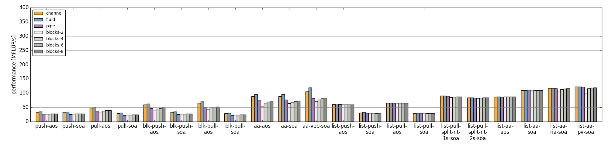
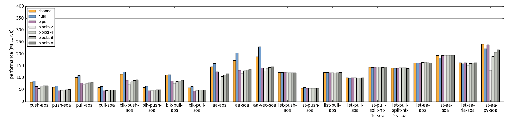
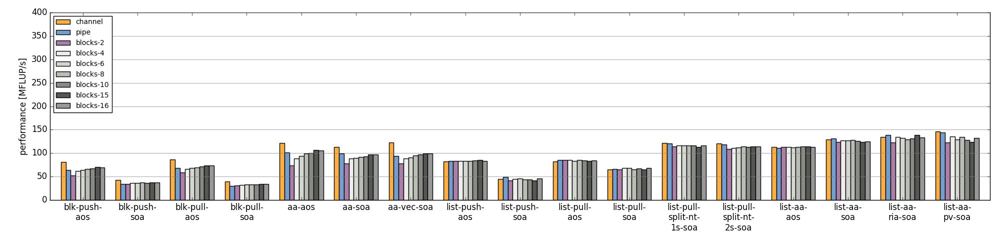
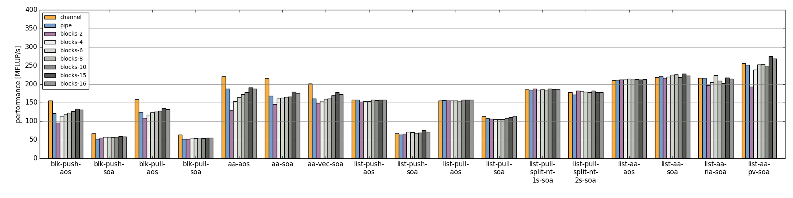
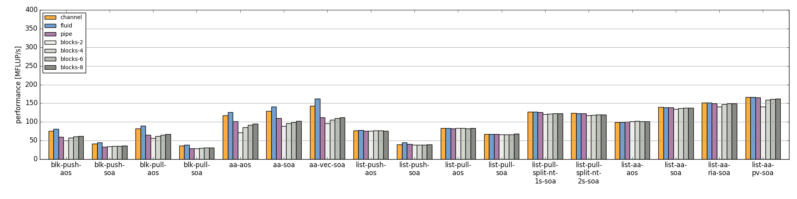
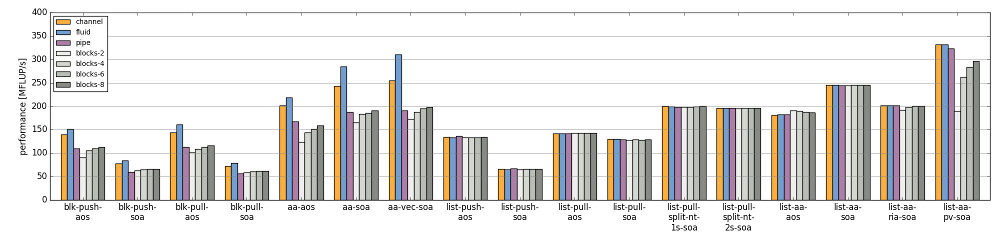
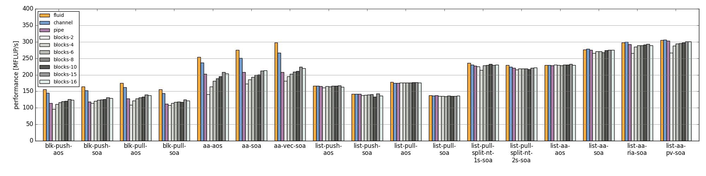
.. |perf_skylakesp2_sp| image:: images/benchmark-skylakesp2-sp.png
   :scale: 50 %
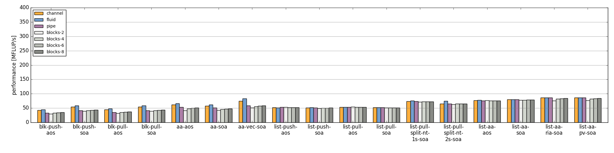
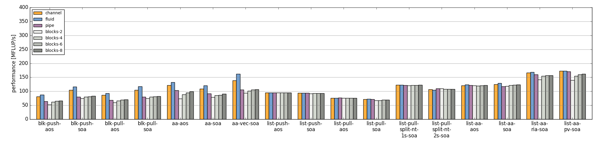
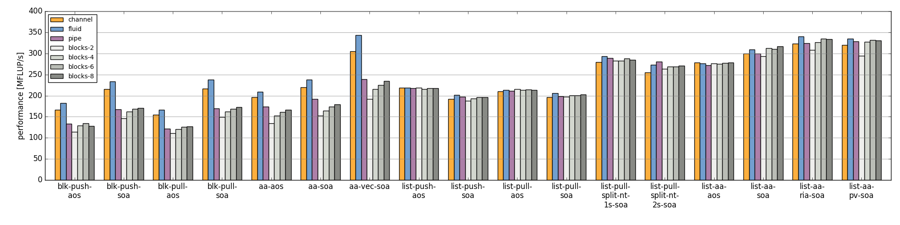
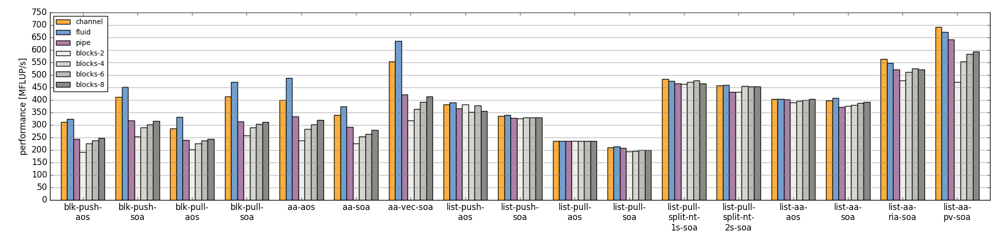

.. list-table::

  * - Ivy Bridge, Intel Xeon E5-2660 v2, Double Precision
  * - |perf_emmy_dp|
  * - Ivy Bridge, Intel Xeon E5-2660 v2, Single Precision
  * - |perf_emmy_sp|
  * - Haswell, Intel Xeon E5-2695 v3, Double Precision
  * - |perf_hasep1_dp|
  * - Haswell, Intel Xeon E5-2695 v3, Single Precision
  * - |perf_hasep1_sp|
  * - Broadwell, Intel Xeon E5-2630 v4, Double Precision
  * - |perf_meggie_dp|
  * - Broadwell, Intel Xeon E5-2630 v4, Single Precision
  * - |perf_meggie_sp|
  * - Skylake, Intel Xeon Gold 6148, Double Precision, **NOTE: currently we only use AVX2 intrinsics.**
  * - |perf_skylakesp2_dp|
  * - Skylake, Intel Xeon Gold 6148, Single Precision, **NOTE: currently we only use AVX2 intrinsics.**
  * - |perf_skylakesp2_sp|
  * - Zen, AMD Ryzen 7 1700X, Double Precision
  * - |perf_summitridge1_dp|
  * - Zen, AMD Ryzen 7 1700X, Single Precision
  * - |perf_summitridge1_sp|
  * - Zen, AMD EPYC 7451, Double Precision
  * - |perf_naples1_dp|
  * - Zen, AMD EPYC 7451, Single Precision
  * - |perf_naples1_sp|

Licence
=======

The Lattice Boltzmann Benchmark Kernels are licensed under GPLv3.

Acknowledgements
================

This work was funded by BMBF, grant no. 01IH15003A (project SKAMPY).

This work was funded by KONWHIR project OMI4PAPS.

Bibliography
============

.. [ginzburg-2008]
 I. Ginzburg, F. Verhaeghe, and D. d'Humières. 
 Two-relaxation-time lattice Boltzmann scheme: About parametrization, velocity, pressure and mixed boundary conditions. 
 Commun. Comput. Phys., 3(2):427-478, 2008.

.. [williams-2008]
 S. Williams, A. Waterman, and D. Patterson. 
 Roofline: an insightful visual performance model for multicore architectures. 
 Commun. ACM, 52(4):65-76, Apr 2009. doi:10.1145/1498765.1498785

.. |datetime| date:: %Y-%m-%d %H:%M

Document was generated at |datetime|.

